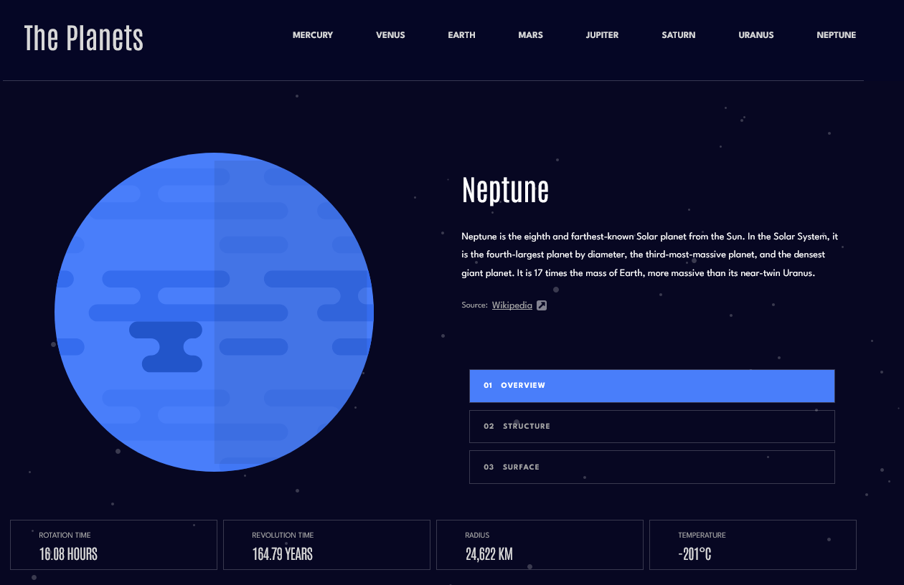

# Frontend Mentor - Planets fact site solution

This is a solution to the [Planets fact site challenge on Frontend Mentor](https://www.frontendmentor.io/challenges/planets-fact-site-gazqN8w_f). Frontend Mentor challenges help you improve your coding skills by building realistic projects.

### The challenge

Users should be able to:

- View the optimal layout for the app depending on their device's screen size
- See hover states for all interactive elements on the page
- View each planet page and toggle between "Overview", "Internal Structure", and "Surface Geology"

### Screenshot

### Links

- Solution URL: https://github.com/cgojk/planets.git
- Live Site URL:

## My process

### Built with

- Semantic HTML5 markup
- CSS custom properties
- Flexbox
- CSS Grid
- Mobile-first workflow
  -React routers
  -Responsive media queries
  -SCSS/CSS nesting

### What I learned

I learned to avoid using large margins to position elements when the spacing is actually caused by another component, such as a fixed header. Instead, I can manage spacing at the layout or container level.
I also became more comfortable using responsive breakpoints and structuring my CSS around meaningful layout changes rather than adding many unnecessary breakpoints.
Working with React Router helped me understand how to structure navigation between different pages while keeping the application organised.

### Continued development

- I would like to improve the organisation and maintainability of my CSS by reducing unnecessary styles and keeping related layout rules together.
- I want to continue improving my understanding of responsive design so that layouts adapt naturally between different screen sizes rather than relying on fixed positioning or large margins.
- I would like to become more confident with CSS specificity and nesting so that \* I can identify styling conflicts more quickly.
- I also want to improve the reusability of my React components and avoid repeating code where components or shared styles could be used instead.
  \*In future projects, I would like to pay more attention to accessibility, including keyboard navigation, semantic elements, focus states and accessible navigation.

### Useful resources

MDN Web Docs — CSS, HTML and JavaScript documentation
CSS-Tricks — CSS layout and responsive design articles
React documentation — React components and concepts
React Router documentation — Routing and navigation in React

## Author

Catalina G.

## Acknowledgments
